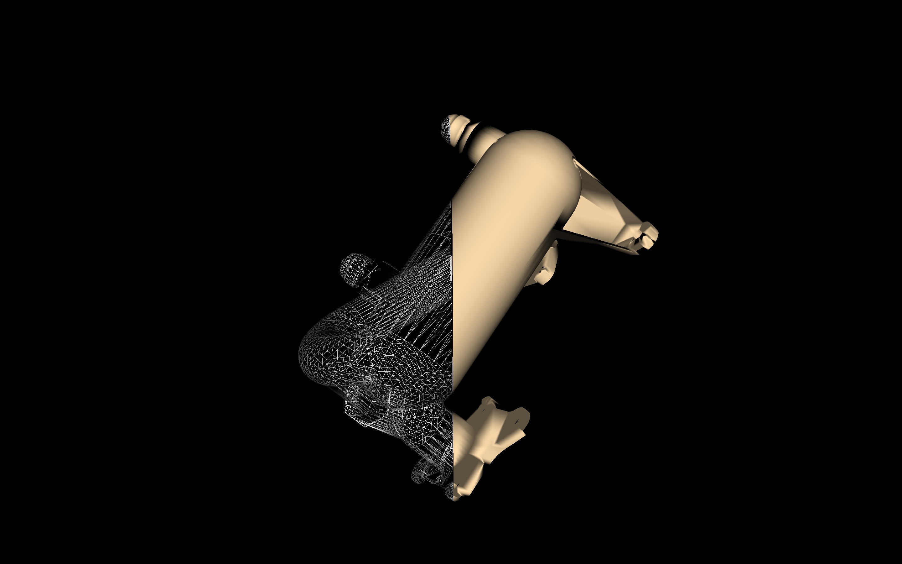
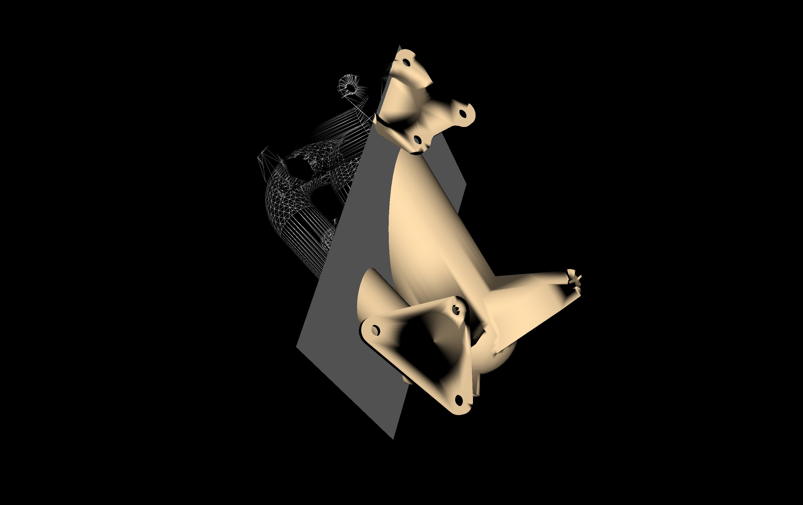
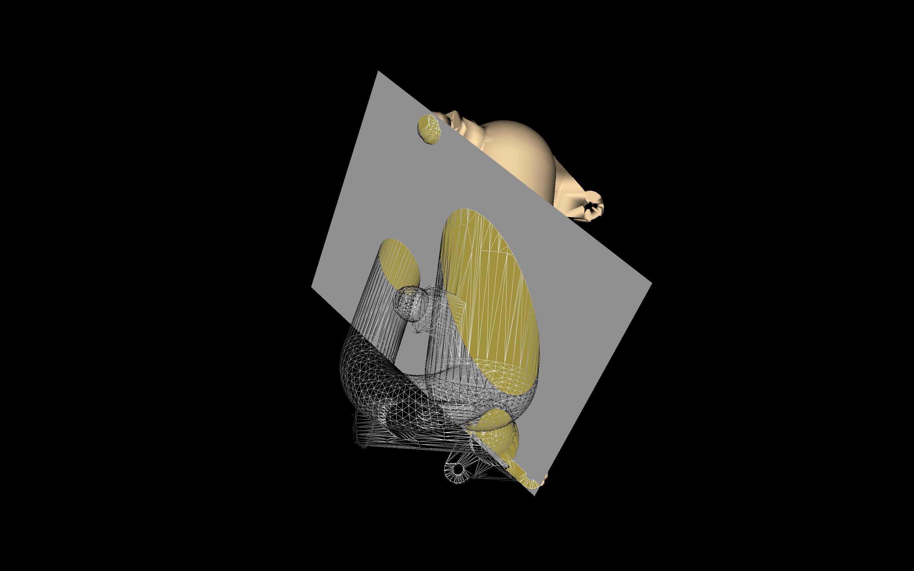

## Graphics and Animation Assignment 2 : Implicit Funtions and Cropping

|   |   |   |
|---|---|---|
| </img>  | </img>  | </img>  |

## Requirements:
The following tools were used to develop this program.

   + Python 2.7.10 64 bit. This can be installed using Anaconda.
    
   + An IDE like PyCharm or Spyder or any other python execution environment. 
    
   + VTK version 8.1.0.
    
    
# Instuctions:
   + Load the python file "crop.py" into an IDE of your choice. Make sure the Python version is 2.7.10 and VTK 8.1.0
    is installed. If using a virtual environment, make sure to set the interpreter of the IDE to the appropriate python executable of the desired virtual environment.
    
   + Run "crop.py".

   + Use the mouse pointer to rotate the object.  
