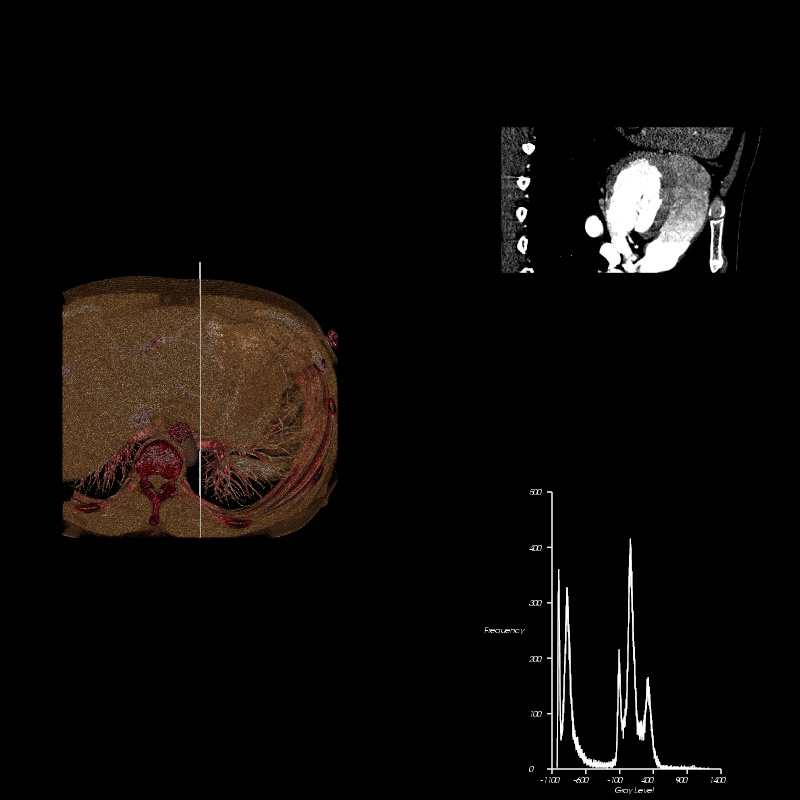

## Graphics and Animation Assignment 3 : Volume Rendering, Interaction and Histogram Computation

## Requirements:
The following tools were used to develop this program.

   + Python 2.7.14 64 bit. This can be installed using Anaconda.
    
   + An IDE like PyCharm or Spyder or any other python execution environment. 
    
   + VTK version 7.1.1.
    
    
## Instuctions:
   + Load the python file "assignment3.py" into an IDE of your choice. Make sure the Python version is 2.7. and VTK 7.1.1
       is installed. If using a virtual environment, make sure to set the interpreter of the IDE to the appropriate python 
       executable of the desired virtual environment.
    
   + Change the path to the DICOM data directory on line 63 to the desired path.      
    
   + Run the file.
    
   + Once the render window appears, you can use the mouse wheel(scroll) or trackpad to move the plane slicer or you can use the 'left' and 'right'
       arrow keys on your keyboard to move the slicer. You can observe changes in the histogram as well as the cross-section sampled 
       output in the top right view port. 
